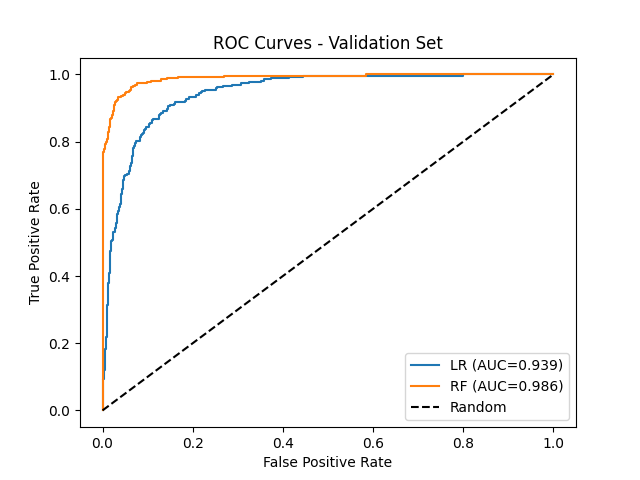

# End-to-End ML: Salary Prediction & Superhost Classification


Two end-to-end machine learning pipelines built on real-world, imperfect data. The regression workflow predicts annual salary from a self-reported survey; the classification workflow predicts Airbnb superhost status from scraped Singapore listings with heavy missingness and temporal duplication.

---

## Salary Prediction (Regression)

**Data:** *Ask A Manager* 2021 survey — 23,384 responses with free-text job titles, mixed currencies, and extreme compensation outliers.

The raw salary distribution is severely right-skewed (skewness ≈ 119). After filtering to USD respondents and clipping outliers at [$15k, $500k], the target is log-transformed and split with stratification on binned log-salary to preserve the income spectrum across train/val/test.

<p align="center">
  
</p>

**Preprocessing & Feature Engineering:**
- Fuzzy string matching on country names to isolate US respondents
- Regex-based seniority extraction from job titles (junior / senior / manager / director / C-level)
- Ordinal encoding for age, education, and experience bands
- One-hot / multi-hot encoding for gender, industry, and race
- Interaction features: education × experience, field/overall experience ratio

**Models:** Ridge Regression, XGBoost, Stacking Ensemble (Ridge + XGBoost → Ridge meta-learner)

<p align="center">
  
</p>

**Test-set results:**

| Model | RMSE (USD) | MAE (USD) | R² (log scale) |
|-------|-----------|-----------|----------------|
| Ridge | ~$66k | ~$16k | 0.88 |
| XGBoost | ~$58k | ~$14k | 0.91 |
| Stacking | ~$57k | ~$14k | 0.91 |

Error scales with salary band — well-calibrated below $100k, wider variance in the sparse executive tail above $200k.

<p align="center">
  
</p>

---

## Airbnb Superhost Prediction (Classification)

**Data:** Inside Airbnb Singapore listings across 4 timepoints — 13,881 properties.

The core challenge is preventing data leakage: the same listing ID appears across multiple timepoints with potentially changing superhost status. A naïve row-wise split would place the same host in both training and test sets. The pipeline uses an **ID-stratified split** where the last-known superhost status per listing drives stratification, and no ID appears in more than one split.

<p align="center">
  
</p>

**Preprocessing & Feature Engineering:**
- Temporal forward-filling of review metrics by listing ID
- Parsing of price, acceptance rate, and response rate from mixed string formats
- SMOTE + RandomUnderSampler applied **only** to the training split
- Temporal features: host tenure, listing age, days since last review
- Frequency encoding for high-cardinality categoricals (neighbourhood, property type)

**Models:** Logistic Regression (balanced), Random Forest (balanced), XGBoost

<p align="center">
  
</p>

**Test-set results:**

| Model | Accuracy | F1 | Balanced Acc | ROC-AUC |
|-------|----------|-----|--------------|---------|
| Logistic Regression | 0.87 | 0.65 | 0.89 | 0.95 |
| Random Forest | 0.88 | 0.68 | 0.89 | 0.95 |
| XGBoost (tuned) | 0.89 | 0.71 | 0.90 | 0.96 |

Feature engineering (review aggregates, temporal deltas, host verification counts) contributes more to performance than model family selection.

<p align="center">
  
</p>

---

## Repository Structure

```
ML_Portfolio/
├── src/ml_portfolio/          # Production pipeline package
│   ├── regression/            # Preprocessing → Features → Models → Pipeline
│   └── classification/        # Same structure, with SMOTE & ID-stratified split
│
├── scripts/
│   ├── train_regression.py    # CLI entry point
│   └── train_classification.py
│
├── tests/                     # Smoke tests for both pipelines
│
├── notebooks/
│   ├── regression/            # 01_explanatory_data_analysis.ipynb → 08_model_explainability.ipynb
│   └── classification/        # Same 8-step flow
│
├── data/raw/                  # Original CSVs (never modified)
├── data/cleaned/              # Generated train/val/test splits + metadata
├── models/                    # .pkl (sklearn/XGBoost) and .pth (PyTorch)
└── figures/                   # Visualisations referenced above
```

The notebooks contain the full exploration narrative — EDA, dead ends, visual validation. The `src/` package is the distillation: modular functions, type hints, path abstraction, and smoke tests that verify no regression in data leakage or feature mismatch across splits.

---

## Quick Start

### Installation

```bash
# Install dependencies (uv is recommended)
uv sync

# Run tests
just test
# or without just:
PYTHONPATH=src python run_tests.py
```

### Train from scratch

```bash
# Full end-to-end pipeline for either track
just train-regression
just train-classification
```

### Explore the notebooks

```bash
uv run jupyter notebook
# Navigate to notebooks/regression/ or notebooks/classification/
# Notebooks are numbered 01–08 and must be run in sequence
```

---

## Technical Stack

| Layer | Choice |
|-------|--------|
| DataFrames | Polars (primary), Pandas for sklearn interop |
| ML | scikit-learn, XGBoost, imbalanced-learn |
| Deep Learning | PyTorch (MLP baselines for both tracks) |
| Explainability | SHAP |
| Viz | matplotlib, seaborn |
| Packaging | `uv` + `pyproject.toml` with hatchling |
| Testing | pytest + lightweight custom runner |
| Dev Tools | ruff (jupyter-ruff), nbconvert, scipy-stubs |

Random seed `42` is locked everywhere — `numpy`, `sklearn`, `torch`, `imbalanced-learn` — and the `uv.lock` file pins dependency versions exactly.

---

## Reproducibility

There are no network calls. All data is local CSV and Parquet. Raw files in `data/raw/` are treated as immutable; every downstream artefact (cleaned splits, scalers, models, figures) is generated deterministically from them. Modifying preprocessing and re-running from step 02 onward regenerates all dependent artefacts consistently.

---

## License

MIT License — see [LICENSE](LICENSE).
